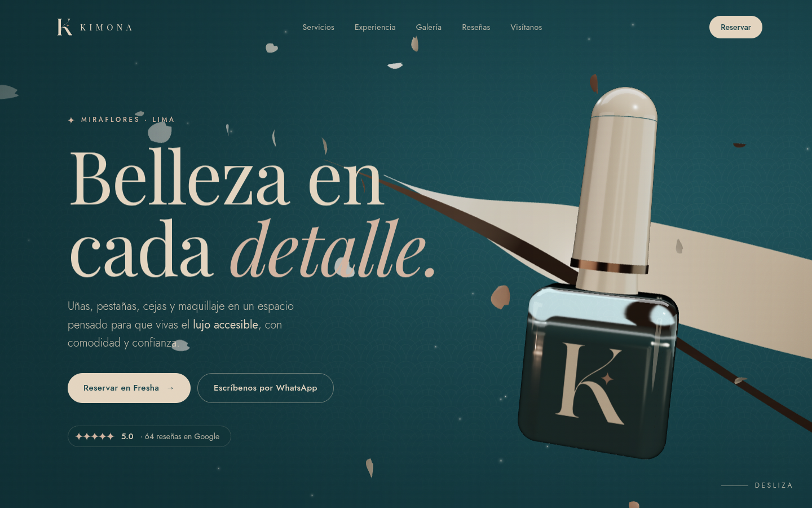
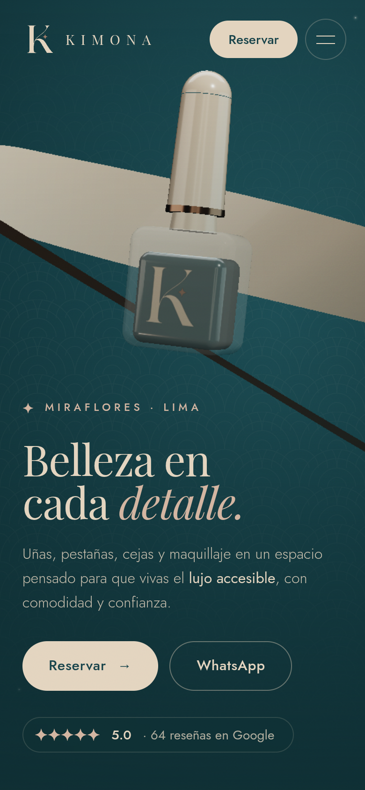
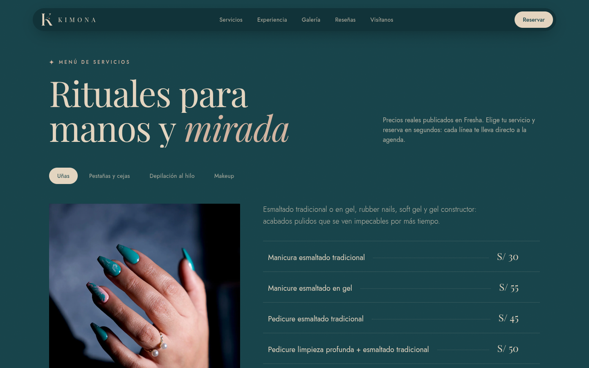
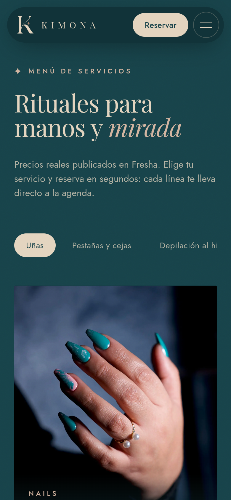
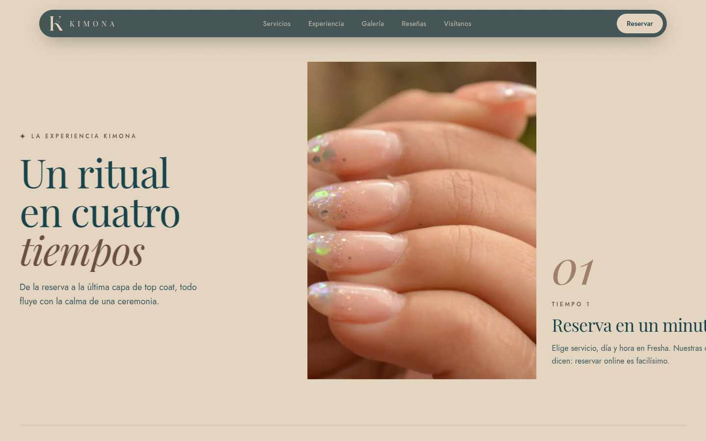
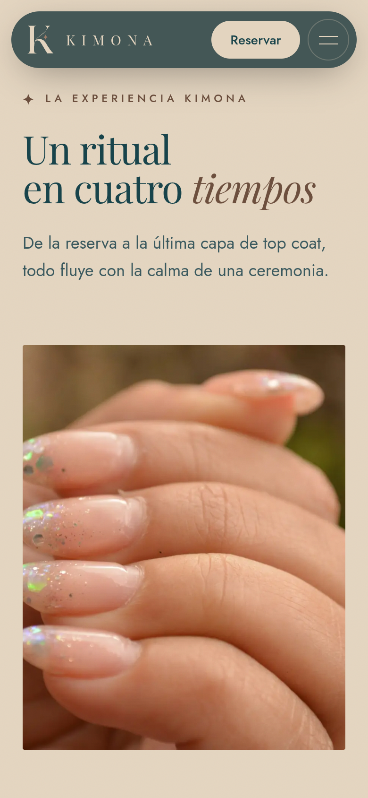
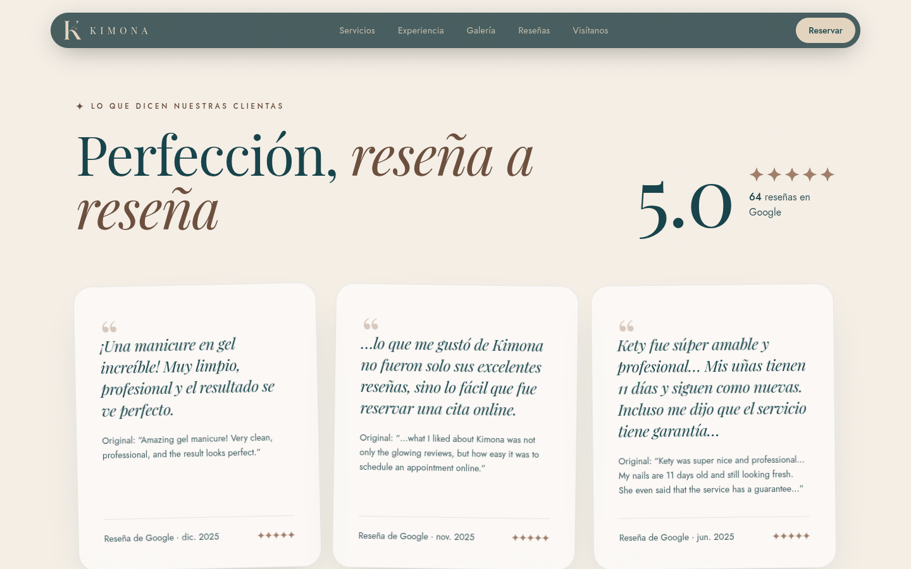
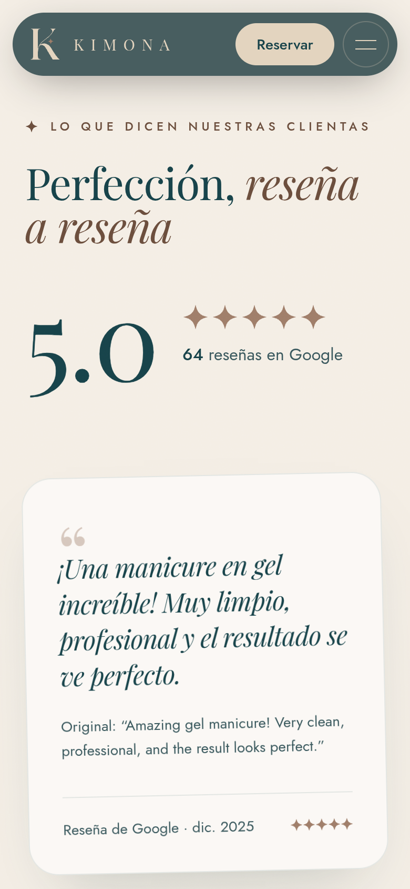
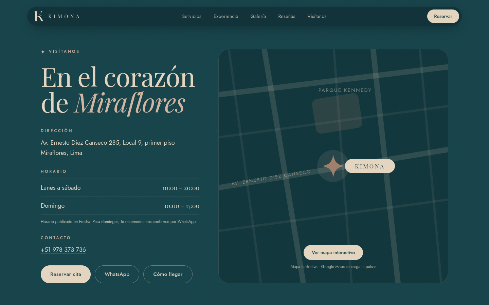
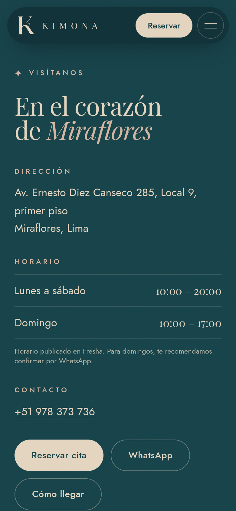

# Kimona Salon · Demo de rediseño web

> ⚠️ **Demo conceptual NO oficial.** Propuesta comercial de rediseño preparada por INKRAAD (Sebastián) para Kimona Salon. No está afiliada ni aprobada por la marca. Las fotografías son imágenes referenciales de bancos libres; los datos de negocio provienen de fuentes públicas (ver abajo).



## La marca
- **Kimona Salon** (razón social aparente KIMONA BEAUTY S.A.C.): salón de **uñas, pestañas, cejas, depilación al hilo y maquillaje**.
- **Distrito:** Miraflores, Lima · Av. Ernesto Diez Canseco 285, Local 9, primer piso (zona Parque Kennedy).
- **Reputación:** 5.0★ con 64 reseñas en Google (dato de oct. 2026; confirmar en vivo antes del pitch).
- **Presencia actual:** **sin web propia**. Opera con reservas en [Fresha](https://www.fresha.com/es/a/kimona-miraflores-kimona-salon-unas-y-maquillaje-avenida-ernesto-diez-canseco-285-kmltfdcm), [Instagram @kimona.salon](https://www.instagram.com/kimona.salon/) (~1.9 k seguidores), [Facebook](https://www.facebook.com/kimonabeauty/) y WhatsApp (+51 978 373 736).
- **Identidad:** monograma «K» arena sobre verde petróleo con destello cobre de 4 puntas. Paleta `#18434A` · `#E3D4BF` · `#9F7D69`. Ver [`docs/manual-de-marca.md`](docs/manual-de-marca.md).

## Qué se construyó

### Concepto creativo: «El cruce del kimono»
Las diagonales del monograma K se leen como el cruce del cuello de un kimono. La web convierte esa idea en una experiencia serena de inspiración japonesa: un **frasco de esmalte 3D** con la K oficial en la etiqueta flota entre **cintas de seda** (obi) que ondulan en diagonal, **pétalos** que caen y destellos cobre; la cortina del loader se abre en diagonal como un kimono y el **destello de 4 puntas** del logo se vuelve el sistema de iconos (rating, cursor, viñetas, pin del mapa). Lujo accesible, sin estridencias.

### Secciones
1. **Loader de marca**: la K se dibuja con un trazo, aparece el destello y la cortina se abre en diagonal.
2. **Hero 3D** (React Three Fiber): frasco de vidrio con transmisión real, laca verde petróleo, tapa arena y anillo cobre; cintas de seda con material *sheen*; pétalos instanciados; parallax con el puntero y rotación ligada al scroll. CTA **Reservar en Fresha** + WhatsApp + chip 5.0★ (64 reseñas).
3. **Marquee** de servicios.
4. **Filosofía / propuesta de valor**: texto que se ilumina palabra por palabra con el scroll (basado en la descripción oficial en Fresha) + 3 pilares (lujo accesible, comodidad, confianza) e imagen con máscara en V.
5. **Menú de servicios con precios reales de Fresha** en pestañas accesibles (Uñas, Pestañas y cejas, Depilación al hilo, Makeup), cada línea enlaza a la reserva; tarjeta del **combo manicure + pedicure S/150 (Ahorra 14%)**.
6. **La experiencia Kimona**: scroll horizontal fijado (GSAP ScrollTrigger) en 4 tiempos con parallax interno.
7. **Galería** con columnas en parallax y tarjetas con tilt táctil + brillo.
8. **Reseñas de Google**: 5.0 con contador animado, 3 citas reales (traducción + original en inglés).
9. **Nosotras**: historia y equipo citado en reseñas (Kety, Mabel, la fundadora).
10. **Visítanos**: dirección, horario, contacto y mapa (ilustración ligera que carga Google Maps interactivo al pulsar, por rendimiento/privacidad).
11. **CTA final** y **footer** con redes, créditos de imágenes y aviso de demo.

### Efectos e interacciones
- Three.js / R3F + drei: `MeshPhysicalMaterial` con transmisión, clearcoat y sheen; entorno de luz procedural con `Lightformer` (sin HDRIs externos); `Float`, `Sparkles`, pétalos con `InstancedMesh`; cintas deformadas por CPU con perfil afinado.
- GSAP ScrollTrigger: revelado de titulares palabra a palabra, scrub de opacidad, pin + scroll horizontal, parallax de columnas, máscaras con `clip-path`.
- Lenis (smooth scroll) sincronizado con ScrollTrigger.
- Motion: indicador de pestañas con `layoutId`, transiciones de panel/imagen, botones magnéticos, menú móvil con revelado en clip-path.
- Cursor personalizado con el destello del logo (solo puntero fino).
- Grano de papel *washi* y patrón *seigaiha* en SVG.

### Rendimiento, accesibilidad y SEO
- La escena 3D se carga en *lazy chunk* (three no bloquea el primer render), se precarga durante el loader y se **pausa fuera de pantalla**. En móvil: sin transmisión (vidrio translúcido simple), menos pétalos/partículas, DPR limitado. Fallback a imagen estática sin WebGL o si la escena falla.
- `prefers-reduced-motion`: sin loader animado, sin Lenis, sin pin horizontal (layout en grid), escena 3D estática, sin cursor custom.
- Contraste AA verificado (tokens derivados documentados en el manual), `alt` en todas las imágenes, skip-link, foco visible, pestañas con flechas de teclado, `aria-*` en menú y CTAs.
- SEO: `lang="es-PE"`, title/description, Open Graph + Twitter (`/og-image.jpg`), JSON-LD `NailSalon`/`BeautySalon` (LocalBusiness) con dirección, geo, horario, `aggregateRating` y `ReserveAction`. Se dejó `noindex` porque es una demo; quitarlo al publicar y poner URLs absolutas en `og:image`.
- Fuentes autoalojadas (Playfair Display + Jost vía @fontsource), imágenes WebP 800/1600 con `srcset`.

## Tecnologías
Vite 8 · React 19 · TypeScript · Tailwind CSS v4 · Three.js 0.182 · @react-three/fiber 9 · @react-three/drei 10 · GSAP 3 (ScrollTrigger) · Lenis · Motion · Playwright (capturas).

## Cómo correrlo
Requiere Node 20.19+.

```bash
npm install
npm run dev          # desarrollo en http://localhost:5173
npm run build        # build estático en dist/
npm run preview      # sirve dist/ (http://localhost:4173)
```

Capturas headless (usa Chrome del sistema; `CHROME_PATH` para otra ruta):

```bash
npx vite preview --port 4317 &
node scripts/screenshots.mjs http://localhost:4317/      # desktop + móvil por sección y página completa
node scripts/interactions.mjs http://localhost:4317/     # loader, pestañas, mapa, menú móvil, reduced-motion
```

## Datos: reales vs. de ejemplo
**Reales** (fuente: `docs/brand-research.md`, investigación del 06-oct-2026 en Google Maps/Exa Places, Fresha, Instagram y Facebook): nombre, dirección, coordenadas, teléfono/WhatsApp, redes, enlace de reservas, rating 5.0 y 64 reseñas, las 3 citas de reseñas, **todos los precios** (Fresha, en PEN), combo S/150 «Ahorra 14%», horario y descripción de marca («lujo accesible, comodidad y confianza», «cada pincelada, trazo y detalle aporta poder y belleza»), nombres Kety y Mabel y que la dueña hace lifting/tinte (según reseñas).

**De ejemplo / por confirmar** (marcados en el código):
- Todas las **fotografías** son referenciales de Pexels/Unsplash (no son trabajos ni el local de Kimona).
- Textos de copy redactados para la demo (titulares, «Un ritual en cuatro tiempos», segundo párrafo de «Nosotras»).
- **Equipo**: especialidad de Mabel desconocida («Equipo Kimona»); el nombre de la fundadora no es público.
- **Makeup**: no hay precios públicos → se muestra «Ver en Fresha».
- **Traducciones** de las reseñas (originales en inglés, autor no disponible en la fuente).
- Mapa ilustrado del placeholder: esquemático, no a escala (el mapa real se carga al pulsar).
- Lockup horizontal «K + KIMONA» en la navegación: composición propuesta (la marca no tiene logo horizontal publicado).
- La garantía del servicio solo aparece dentro de la cita textual de una reseña; no se afirma como política.

### ⚠️ Discrepancia de horario (domingo)
- **Google Maps:** Lun–Sáb 10:00–20:00 · **Domingo cerrado**.
- **Fresha:** Lun–Sáb 10:00–20:00 · **Domingo 10:00–17:00**.
- La demo usa **el horario de Fresha** (también en el JSON-LD) y muestra la nota «Horario publicado en Fresha. Para domingos, te recomendamos confirmar por WhatsApp». Confirmar con el salón y unificar ambas fichas.

## Logo
- Original: `public/brand/logo-facebook-960.jpg` (y en `/brand` del proyecto de investigación).
- Vectorial fiel: `public/brand/logo-kimona.svg` (con fondo) y `public/brand/logo-kimona-mark.svg` (solo monograma). La K se vectorizó con potrace desde el original escalado 4×; el destello se redibujó con curvas Bézier ajustadas numéricamente contra el original. Diferencia media por píxel vs. el JPG original < 0,2/255 (comparado visualmente lado a lado).

## Créditos de imágenes
Todas descargadas al repo (`public/images`, convertidas a WebP). Licencias [Pexels](https://www.pexels.com/license/) y [Unsplash](https://unsplash.com/license): uso gratuito, comercial permitido, sin atribución obligatoria (se acredita igualmente).

| Archivo | Autor/a | Fuente |
|---|---|---|
| nails-teal | Salim Da | [Pexels](https://www.pexels.com/photo/elegant-hand-with-green-manicure-and-pearl-ring-34971922/) |
| nails-french | Salim Da | [Pexels](https://www.pexels.com/photo/delicate-hand-with-stylish-french-manicure-35031987/) |
| silk-cream | Davis Vidal | [Pexels](https://www.pexels.com/photo/close-up-photo-of-a-smooth-cream-textile-8465948/) |
| lashes-silk | Fatoba Tolulope Ifemide | [Pexels](https://www.pexels.com/photo/black-woman-with-eyes-closed-and-artificial-lashes-5017084/) |
| lashes-pro | Ekaterina Myasoed | [Pexels](https://www.pexels.com/photo/close-up-of-woman-at-beautician-8554941/) |
| brows | George Milton | [Pexels](https://www.pexels.com/photo/crop-visagiste-painting-eyebrows-of-client-6953617/) |
| nail-art | Kerim Eveyik | [Pexels](https://www.pexels.com/photo/nail-art-22668324/) |
| makeup-bridal | Alexander Mass | [Pexels](https://www.pexels.com/photo/bridal-makeup-preparation-in-soft-lighting-32427370/) |
| nails-minimal | Alesya Gorbunova | [Pexels](https://www.pexels.com/photo/person-hand-with-nail-polish-8872288/) |
| flowers-hold | Arina Krasnikova | [Pexels](https://www.pexels.com/photo/close-up-shot-of-person-holding-flowers-7752610/) |
| lashes-macro | Milky Way Lashes | [Unsplash](https://unsplash.com/photos/a-close-up-of-a-persons-eye-with-long-lashes-GEct9d7zgos) |
| nails-nude | Mailén Aguirre | [Unsplash](https://unsplash.com/photos/a-womans-hand-with-a-manicured-nail-polish-YmQszA5_GkE) |
| hands-rings | Elijah Pilchard | [Unsplash](https://unsplash.com/photos/close-up-of-elegant-manicured-hands-with-rings-vFpYTyGxXNE) |

Autoría tomada de las páginas públicas de cada foto (Pexels/Unsplash) al 06-oct-2026.

## Capturas
| Desktop | Móvil |
|---|---|
|  |  |
|  |  |
|  |  |
|  |  |
|  |  |

Página completa: [`screenshots/desktop-full.jpg`](screenshots/desktop-full.jpg) · [`screenshots/mobile-full.jpg`](screenshots/mobile-full.jpg) (cosidas a partir de capturas de viewport; la sección horizontal aparece como fotogramas).

## Siguientes pasos sugeridos
Fotos reales del salón y de trabajos (IG), versión EN/ES (muchas clientas extranjeras), feed de Instagram, confirmar horario dominical, precios de makeup, equipo y condiciones de la garantía; dominio propio y quitar `noindex`.
